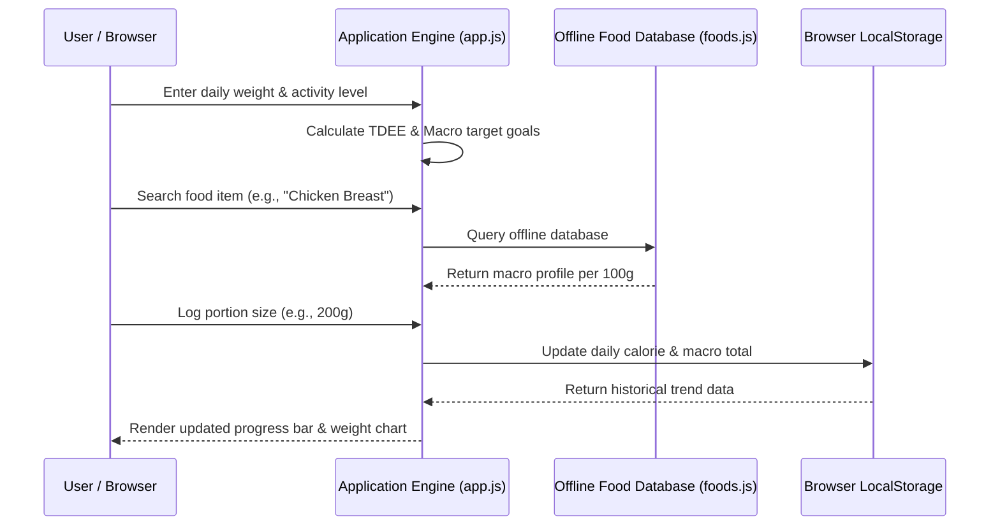

# NutriTrack -- Client-Side Calorie & Weight Tracker

NutriTrack is a privacy-first, free and open-source (FOSS) nutrition tracking and body weight logging application built with pure HTML5, Vanilla CSS, and JavaScript. It operates entirely client-side -- preserving user privacy by storing all meal logs, custom recipes, and weight trends in browser LocalStorage without any external backend servers or data telemetry.

---

## Architecture Topology

```mermaid
graph TB
    subgraph UI_LAYER["HTML5 / CSS Web Interface"]
        DASH[Dashboard Overview]
        LOG[Daily Meal & Calorie Logger]
        WEIGHT[Weight Tracking & Progress Chart]
        CALC[TDEE / MET Activity Calculator]
    end

    subgraph ENGINE["Core JavaScript Engine (js/app.js)"]
        MACRO[Macro Target Calculator (Protein, Carbs, Fat)]
        SEARCH[Offline Food Database Search Engine]
        CUSTOM[Custom Meal & Recipe Builder]
    end

    subgraph LOCAL_DATA["Browser Storage Layer (js/memory.js)"]
        FOOD_DB[Local Food Database (js/foods.js)]
        USER_DATA[User Custom Foods (js/user_foods.js)]
        LOCAL_STORAGE[Browser LocalStorage Logs & Profile]
    end

    DASH & LOG & WEIGHT & CALC --> MACRO & SEARCH & CUSTOM
    SEARCH --> FOOD_DB & USER_DATA
    MACRO & CUSTOM --> LOCAL_STORAGE

    style UI_LAYER fill:#18181b,stroke:#a1a1aa,color:#fff
    style ENGINE fill:#000000,stroke:#ffffff,color:#fff
    style LOCAL_DATA fill:#18181b,stroke:#e4e4e7,color:#fff
```

---

## Daily Workflow Sequence Diagram



---

## Key Features

- **100% Client-Side Privacy**: No account registration, zero remote servers, no third-party tracking. All data remains strictly on your device.
- **Offline Food Database**: Embedded database containing hundreds of common food items with macro breakdowns (calories, protein, carbs, fats).
- **TDEE & BMR Calculator**: Calculates Total Daily Energy Expenditure (TDEE) using the Mifflin-St Jeor equation and MET activity factors.
- **Weight & Goal Progress Tracking**: Monitors body weight trajectory over time with visual progress indicators.
- **Zero Dependencies**: Lightweight, framework-free single-page application requiring no npm install or build step.

---

## Directory Structure

```
NutriTrack/
|-- index.html              # Main application single-page structure
|-- README.md               # ASCII Architecture & User Documentation
|-- LICENSE                 # MIT License file
|-- .gitignore              # Git ignore rules
|-- css/                    # Modular stylesheets
|   |-- styles.css          # Main UI layout & responsive styles
|   `-- reset.css           # CSS reset definitions
`-- js/                     # Application JavaScript logic
    |-- app.js              # Main application orchestrator & UI controller
    |-- foods.js            # Offline nutritional database
    |-- user_foods.js       # Custom user recipes & food storage
    `-- memory.js           # LocalStorage persistent storage wrapper
```

---

## Quick Start Guide

### Running Locally

Because NutriTrack is a client-side web app with zero server dependencies, you can run it in any modern browser:

1. **Clone Repository**:
   ```bash
   git clone https://github.com/siddarth1872004/NutriTrack.git
   cd NutriTrack
   ```

2. **Open index.html**:
   - Simply double-click `index.html` to open it in Chrome, Firefox, Edge, or Safari.
   - Or serve locally using Python:
     ```bash
     python -m http.server 8000
     ```
     Then navigate to `http://localhost:8000`.

---

## License

Distributed under the **MIT License**. See `LICENSE` for details.
