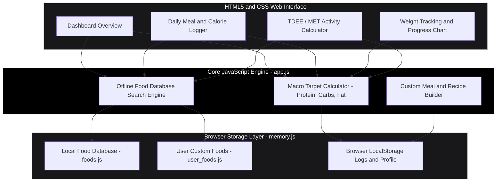
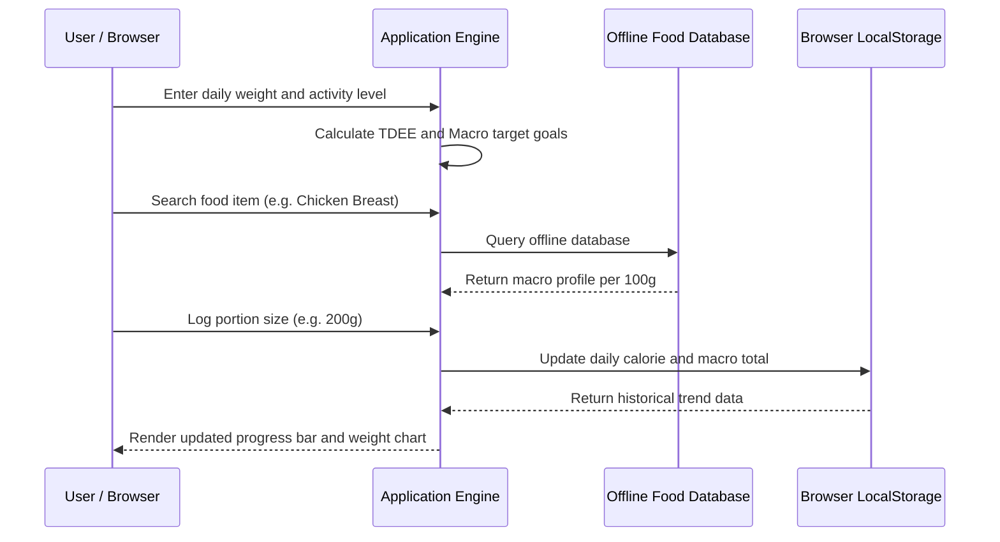

# NutriTrack -- Client-Side Calorie and Weight Tracker

NutriTrack is a privacy-first, free and open-source (FOSS) nutrition tracking and body weight logging application built with pure HTML5, Vanilla CSS, and JavaScript. It operates entirely client-side -- preserving user privacy by storing all meal logs, custom recipes, and weight trends in browser LocalStorage without any external backend servers or data telemetry.

**Live app:** https://siddarth1872004.github.io/NutriTrack/

---

## Architecture Topology



---

## Daily Workflow Sequence Diagram



---

## Key Features

- **100% Client-Side Privacy**: No account registration, zero remote servers, no third-party tracking. All data remains strictly on your device.
- **Offline Food Database**: Embedded database containing hundreds of common food items with macro breakdowns (calories, protein, carbs, fats).
- **TDEE and BMR Calculator**: Calculates Total Daily Energy Expenditure (TDEE) using the Mifflin-St Jeor equation and MET activity factors.
- **Weight and Goal Progress Tracking**: Monitors body weight trajectory over time with visual progress indicators.
- **Zero Dependencies**: Lightweight, framework-free single-page application requiring no npm install or build step.

---

## Directory Structure

```
NutriTrack/
|-- index.html              # Main application single-page structure
|-- favicon.svg             # App icon
|-- README.md               # Architecture and user documentation
|-- LICENSE                 # MIT License file
|-- css/
|   `-- styles.css          # Main UI layout and responsive styles
`-- js/                     # Application JavaScript logic (ES modules)
    |-- app.js              # Main application orchestrator and UI controller
    |-- foods.js            # Offline nutritional database
    |-- user_foods.js       # Custom user recipes and food storage
    `-- memory.js           # LocalStorage persistent storage wrapper
```

---

## Quick Start Guide

### Running Locally

Because NutriTrack is a client-side web app with zero server dependencies, you can run it in any modern browser:

1. **Clone Repository**:
   ```bash
   git clone https://github.com/siddarth1872004/NutriTrack.git
   cd NutriTrack
   ```

2. **Serve the folder** (the app uses ES modules, which browsers block over `file://`, so use a local web server rather than double-clicking `index.html`):
   ```bash
   python -m http.server 8000
   ```
   Then navigate to `http://localhost:8000`.

### Deploying to GitHub Pages

NutriTrack is a static site, so GitHub Pages can serve it straight from the repository with no build step.

1. In the repository, open **Settings > Pages**.
2. Under **Build and deployment**, set **Source** to **Deploy from a branch**, pick `main` and `/ (root)`, then click **Save**.
3. After a minute the site is live at `https://siddarth1872004.github.io/NutriTrack/`. Every push to `main` updates it automatically.

---

## License

Distributed under the **MIT License**. See `LICENSE` for details.
